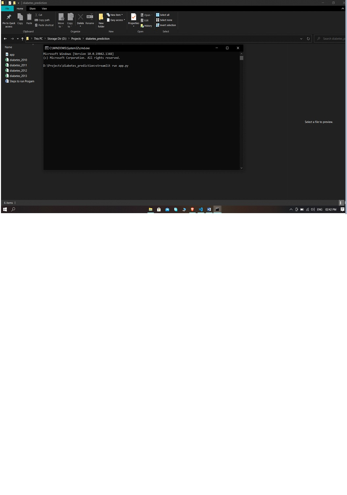
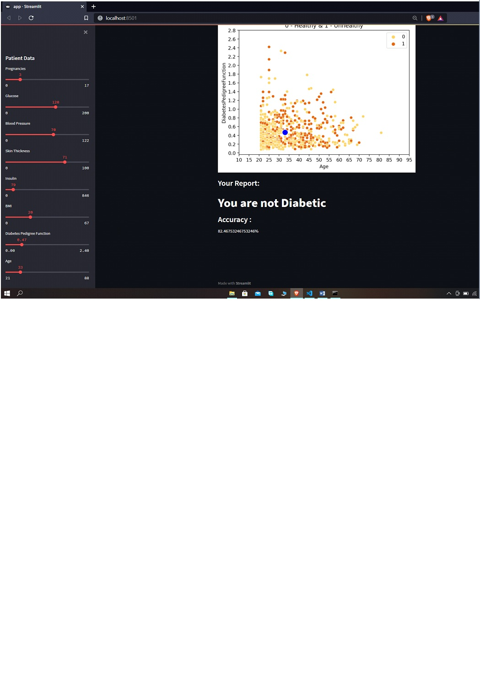

Steps to run a Program:

Step1:
First Install Python 3 in your Computer and tick on pip command

Step2:
After python is installed the next step is to open CMD

Step3:
After opening CMD install all the libraries which are defined in the program using Pip command
pip install streamlit
pip install pandas
pip install sklearn
pip install matplotlib
pip install plotly
pip install seaborn
pip install keras

Step4:
After installing all the libraries , open cmd in same directory where all your datasets and program is available and run the command
streamlit run app.py

Step 5:
It will ask you for a mail if open it first time so enter it.
And After that will open a local host into your browser
And then you can adjust the slider to know that your diabetic or not.

 

